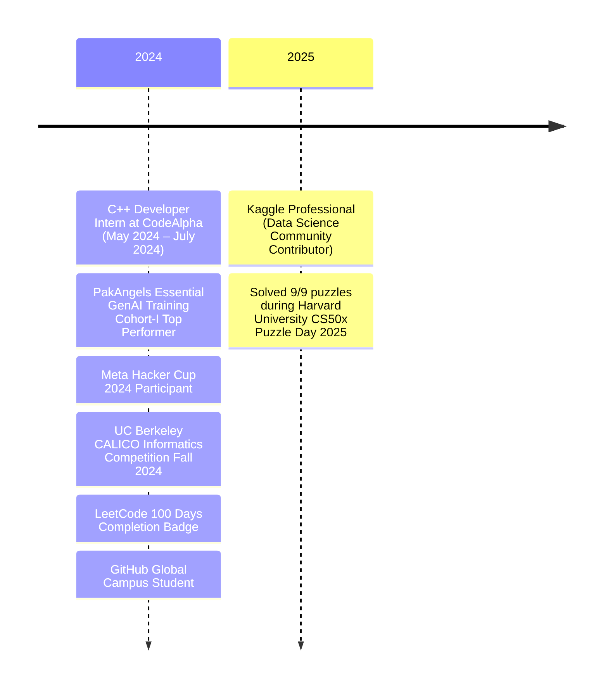

   
  <h1>AYESHA SALEEM</h1>
  
  
  
  

---

**Data Science & Machine Learning Enthusiast | LeetCode Problem Solver**
- Passionate about using AI to solve real-world problems and analyze data.
- Experienced with Python, machine learning tools, and statistical methods to build useful models and extract insights.
- Enjoy collaborating on research, competitive programming, and contributing to open-source projects.

---

## ⚒️ Skills   

| **Category**        | **Skills**        |
|---------------------|------------------|
| **Programming Languages** |    |
| **Data Science & ML** |       |
| **Data Visualization** |    |
| **Web Scraping & APIs** |   |
| **Version Control** |   |
| **Development Tools** |     |
| **Web Development** |    |
| **Competitive Programming** |  |

---

## 🎓 EDUCATION

**Emerson University Multan**  
*Bachelor of Science in Computer Science (BSCS)*  
**CGPA:** 3.86/4.0  
**Sep 2023 – Present**

---

<!--## 🏆 HONORS & AWARDS

- **Harvard CS50x Puzzle Day 2025 Participant** - Took part in the CS50x Puzzle Day, collaborating with a team of 4 to solve 9/9 challenging puzzles and enhance problem-solving skills.
- **Meta Hacker Cup 2024 Participant** – Competed in Meta’s global programming competition, showcasing problem-solving and algorithmic skills.  
- **CALICO Informatics Competition Participant** – Took part in UC Berkeley's CALICO contest to enhance algorithmic thinking.
- **PakAngels Essential GenAI Training Top Performer** – Achieved the highest score in the final quiz, building an AI Chatbot and a Voice-to-Voice Assistant.  
- **Kaggle Contributor** – Published datasets and notebooks contributing to the Data Science community.  
- **LeetCode Problem Solver** – Solved **200+** Data Structures and Algorithms problems.  
- **GitHub Global Campus Student** – Leveraged GitHub Education for learning, version control, and collaborative projects.  

--- -->

# 🏆 Major Achievements Timeline

  

---

## 💼 EXPERIENCE

### **C++ Programming Intern**  
**CodeAlpha** *(Remote)*  
**May 2024 – June 2024**  
- Developed hands-on projects using C++.
- Gained experience in Object-Oriented Programming (OOP) and Data Structures.
- Contributed to real-world applications by writing clean and efficient code.

### **Kaggle Professional**  
**Data Science Community Contributor (Global)**  
**Sep 2024 – Present**  
- Published datasets and notebooks showcasing **Exploratory Data Analysis (EDA)** and **Machine Learning techniques**.
- Participated in **Kaggle competitions**, applying data science skills to solve real-world problems.
- Shared well-documented and interactive data analysis notebooks.

---

## 📊 PROJECTS

### **EDA: Unveiling Sales Patterns**  
📌 **Tools:** Python, Pandas, Matplotlib, Seaborn  
- Performed **Exploratory Data Analysis (EDA)** on sales data to uncover trends.
- Applied **univariate, bivariate, and multivariate analysis** to identify key sales drivers.
- Created **data visualizations** to improve decision-making.

### **LifeLens: Life Expectancy Prediction with Machine Learning**  
📌 **Tools:** Python, Scikit-learn, XGBoost, Matplotlib, Seaborn  
- Developed a **Machine Learning model** to predict life expectancy based on health, economic, and social factors.
- Conducted **data preprocessing** including encoding, scaling, and handling missing values.
- Implemented **GridSearchCV** for hyperparameter tuning to improve model performance.

### **Titanic Survivor Prediction With Machine Learning**  
📌 **Tools:** Python, Pandas, Logistic Regression, Naive Bayes  
- Performed **EDA** to analyze survival rates based on demographics and ticket class.
- Applied **data cleaning techniques** to handle missing values and outliers.
- Built and evaluated **Logistic Regression** and **Naive Bayes** models to predict survival probabilities.

---
<!--
# Projects 

> Find all of my projects at [GitHub](https://github.com/aysh34) and [Kaggle](https://www.kaggle.com/ayeshasal89) with details on datasets, notebooks, and machine learning models.

&nbsp;

| **Project** | **Deployed Link** | **Repository** | **Tech Stack & Tools** |
|------------|:-------------:|:----------:|:-------------------|
| **EDA: Unveiling Sales Patterns** | - | [View](https://github.com/aysh34/EDA-Sales-Patterns) | `Python` `Pandas` `Matplotlib` `Seaborn` |
| **LifeLens: Life Expectancy Prediction** | - | [View](https://github.com/aysh34/LifeLens-Prediction) | `Python` `Scikit-Learn` `XGBoost` `Matplotlib` |
| **Titanic Survivor Prediction** | - | [View](https://github.com/aysh34/Titanic-Survivor-Prediction) | `Python` `Pandas` `Logistic Regression` `Naive Bayes` |
| **AI Chatbot & Voice Assistant** | - | [View](https://github.com/aysh34/AI-Chatbot-Voice-Assistant) | `Python` `Hugging Face Transformers` `Speech Recognition` |

  -->

## 📊 GitHub Metrics

  
  

  

---
## 🏅 Certificates

  
  &nbsp; &nbsp;
  
  
  &nbsp; &nbsp;
  
  
  &nbsp; &nbsp;
  
  
  &nbsp; &nbsp;
  
  
  &nbsp; &nbsp;
  
  

