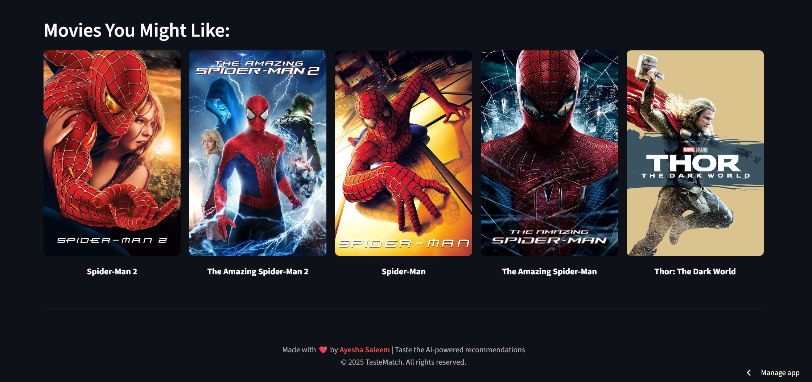
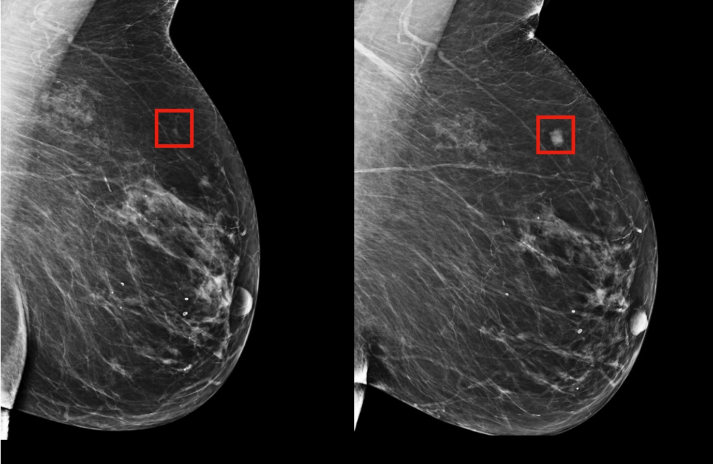

# **Ayesha Saleem**

### Computer Science Student | Machine Learning Engineer | AI Researcher

## About Me

I'm a Computer Science undergraduate deeply invested in **machine learning**, **explainability**, and **AI for social impact**. I specialize in transforming raw data into real-world, transparent solutions using classification models, interpretable ML tools, and complete AI pipelines.

- **2+ years** hands-on experience with SHAP, LIME, Scikit-learn, XGBoost, and Python-based tools
- **Global competition winner** with proven track record in algorithmic problem-solving
- **5+ deployed ML applications** serving real users in healthcare, entertainment, and logistics
- **Published Kaggle Expert** with datasets and notebooks used by the ML community
- Interested in **responsible AI**, **human-centered AI**, and research-backed innovation
- Actively contributing to open-source, hackathons, and ML research communities

## Core Competencies

|                                **Machine Learning**                                |                           **Software Development**                            |                                        **Data Science**                                        |                                         **Problem Solving**                                          |
| :--------------------------------------------------------------------------------: | :---------------------------------------------------------------------------: | :--------------------------------------------------------------------------------------------: | :--------------------------------------------------------------------------------------------------: |
|                |            |                 |                          |
|  |  |  |  |

## Academic Excellence

**Emerson University, Multan**  
_Bachelor of Science in Computer Science (BSCS)_  
**CGPA:** 3.86 / 4.00 (96.5%)  
**Duration:** September 2023 – Present

**Highlights:**

- Ranked **1st** in class
- Awarded **University Merit Scholarship**
- Relevant Coursework: Data Structures & Algorithms, Artificial Intelligence, OOP, Calculus, Database Systems

## Research Interests

I'm currently focused on applied machine learning with a strong interest in **Explainable AI**, **AI for Social Good** and **Responsible AI** reducing bias and improving fairness in predictive models.

## Achievements & Recognition

- **Harvard CS50x Puzzle Day Champion (2025)** - Solved 9/9 puzzles, secured 1st place globally
- **Kaggle Expert** - Published datasets, notebooks, and competed in real-world ML challenges
- **Meta Hacker Cup Qualifier (2024)** - Showcased algorithmic prowess in global competition
- **UC Berkeley CALICO Competition (2024)** - Enhanced computational thinking skills
- **LabLab.ai AI Hackathon Veteran** - Multiple international AI hackathon participations
- **LeetCode 230+ Problems Champion** - Advanced algorithmic problem-solving skills

## Featured Projects

<table>
<tr>
<td width="50%">

### **TasteMatch** - AI Movie Recommendation System

Content-based movie recommender using Sentence Transformers (MiniLM-L6-v2). Explores semantic matching in real-world recommendation settings with advanced NLP techniques.

**Tech Stack:**  
  

**[Try Live App](https://tastematch-kfdxsz24xk9bbypttq9dtw.streamlit.app/)**

</td>
<td width="50%">

### **OncoPredict AI** - Breast Cancer Detection

Early breast cancer detection using advanced ML pipeline and hyperparameter tuning. Designed for healthcare-focused ML applications with high accuracy and interpretability.

**Tech Stack:**  
  

**[View GitHub](https://github.com/aysh34/OncoPredict-AI)**

</td>
</tr>
<tr>
<td width="50%">

### **SupplyShield 2.0** - Smart Risk Detection

AI-powered risk detection system for logistics using anomaly detection algorithms. Built during AI hackathon, featuring real-time monitoring and predictive analytics.

**Tech Stack:**  
  

**[View on LabLab.ai](https://lablab.ai/event/execute-ai-genesis/binge-thinkers/supplyshield-smart-risk-detection)**

</td>
<td width="50%">

### **LifeLens** - Life Expectancy Prediction

Predicting life expectancy using socioeconomic and health indicators with advanced regression techniques and feature engineering for global health insights.

**Tech Stack:**  
  

**[View GitHub](https://github.com/aysh34/Life_Expectancy_Prediction_With_Machine_Learning)**

</td>
</tr>
<tr>
<td colspan="2">

### **Sales Pattern Explorer** - Business Intelligence

Deep exploratory data analysis on business sales data to uncover seasonality trends, correlation insights, and actionable business intelligence.

**Tech Stack:**   

**[View GitHub](https://github.com/aysh34/Unveiling-Sales-Patterns-with-EDA)**

</td>
</tr>
</table>

## Technical Skills

| **Category**                | **Technologies**                                                                                                                                                                                                                                                                                                                                                                                                                                                                                                                                                                                                                                                                                                                                                                                                       |
| --------------------------- | ---------------------------------------------------------------------------------------------------------------------------------------------------------------------------------------------------------------------------------------------------------------------------------------------------------------------------------------------------------------------------------------------------------------------------------------------------------------------------------------------------------------------------------------------------------------------------------------------------------------------------------------------------------------------------------------------------------------------------------------------------------------------------------------------------------------------- |
| **Programming Languages**   |                                                                                                                                                                                                                                                                                                                                                                                                                                                    |
| **Frameworks / Web**        |                                                                                                                                                                                                                                                                                                                                                                                                                                                                                                                              |
| **Machine Learning / AI**   |                                                                                                                                                                                                                                                                                        |
| **Data Science / Analysis** |                                                                                                                                                                                                                                                                                                                                                             |
| **Databases**               |                                                                                                                                                                                                                                                                                                                                                                                                                                                                                                                                                                                                                                   |
| **Tools & Platforms**       |         |
| **Deployment & DevOps**     |                                                                                                                                                                                                                                                                                                                                                                                                                                                                                                                             |

## GitHub Statistics

  
  

  

## Competitions and Hackathons Gallery

## Professional Contact

   

    
    
    
    
  

